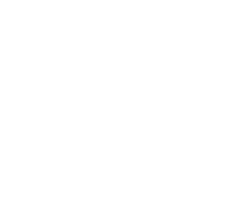

<br>


<div style="font-weight:bold; font-size:32px;"> EOLO MP </div> 

# 

## Informe de calibración: motores y flujo de aire
 
 El EOLO dispone de dos motores DC, los cuales se usan para mantener un flujo de aire estable durante la medición de material particulado.

### Diferencias entre EOLO grande y EOLO pequeño

Existen dos variantes del EOLO con diferencias importantes en el sistema de medición de flujo y configuración de motores:

#### EOLO pequeño
- **Sensor de flujo**: 
  - **Primera versión**: FS3000 (sensor de velocidad de viento)
  - **Versión actual**: AFM07 (sensor de flujo directo)
- **Requiere precalibración**: 
  - **Primera versión con FS3000**: Sí (ver sección siguiente)
  - **Version actual con AFM07**: No (el AFM07 mide flujo directamente en L/min)
- **Motores**: Dos motores del mismo tamaño

#### EOLO grande
- **Sensor de flujo**: AFM07 (sensor de flujo directo)
- **Requiere precalibración**: No (el AFM07 mide flujo directamente en L/min)
- **Motores**: Dos motores de diferente tamaño
  - **Motor pequeño**: Se enciende primero, mayor precisión en flujos bajos
  - **Motor grande**: Se enciende después, permite alcanzar flujos más altos

El proceso de calibración se puede separar en los siguientes pasos:

### Precalibración del sensor de flujo

> Esta sección aplica **únicamente a la primera versión del EOLO pequeño**. Las versiones modernas del EOLO pequeño y el EOLO grande usan el sensor AFM07 directamente y no requieren este paso de precalibración.

Antes de calibrar los motores en el EOLO pequeño, es necesario establecer la relación entre la **velocidad del viento medida por el sensor de velocidad FS3000** y el **flujo real** en litros por minuto (L/min).

#### Proceso de caracterización de la pieza

1. **Configuración**: Se hace pasar aire a diferentes caudales conocidos a través de:
   - **AFM07**: Sensor de referencia que mide el flujo real en L/min
   - **FS3000**: Sensor de velocidad de viento ubicado dentro del EOLO

2. **Lectura de datos**: Para cada caudal de referencia del AFM07, se registra la velocidad correspondiente medida por el FS3000.

3. **Ajuste de curva**: Con los pares de datos (Flujo AFM07, Velocidad FS3000), se genera una curva de calibración que relaciona la velocidad del viento con el flujo real.

#### Gráfico de calibración FS3000 vs AFM07


*Curva de calibración que relaciona la velocidad del viento medida por el FS3000 (dentro de la pieza) con el flujo real medido por el AFM07 (sensor de referencia). Esta relación permite convertir las lecturas de velocidad en valores de flujo en L/min.*

4. **Fórmula de calibración**: A partir del ajuste de curva, se obtiene una ecuación que se implementa en el firmware del EOLO para convertir velocidad (FS3000) a flujo (L/min).

Esta precalibración es clave porque permite que el FS3000, que mide velocidad de viento, reporte valores en L/min basándose en las características específicas de la pieza donde está instalado. Las **versiones modernas del EOLO pequeño** y el **EOLO grande** omiten este paso al usar directamente el AFM07.

### Proceso de calibración de motores

> Este proceso aplica para todas las variantes de EOLO. La diferencia es que:
> - En el **EOLO pequeño**: Originalmente se usaba el flujo calculado del FS3000 (previamente precalibrado). En la versión actual se usa el flujo directo del AFM07
> - En el **EOLO grande**: Se usa el flujo directo del AFM07. Los motores de diferente tamaño se calibran de forma coordinada (motor pequeño primero, grande después)

1. **Barrido de potencia**: El sistema recorre valores de potencia del motor desde 0% hasta 100% en incrementos definidos (1%).
   ```cpp
   // Ejemplo de barrido de potencia
   for (int pct = 0; pct <= 100; pct += 1)
   {
       ctx.components.motor.setPowerPct(pct);
       // ... estabilización y muestreo
   }
   ```

2. **Estabilización**: Para cada nivel de potencia, se espera un tiempo de estabilización antes de tomar mediciones.
   ```cpp
   // Tiempo de estabilización antes de muestrear
   const int STABILIZATION_TIME_MS = 2000;
   delay(STABILIZATION_TIME_MS);
   ```

3. **Muestreo de flujo**: Se toman múltiples lecturas del sensor de flujo y se promedian para obtener un valor estable.
   ```cpp
   // Muestreo y promediado del flujo
   const int NUM_SAMPLES = 10;
   float flowSum = 0;
   for (int i = 0; i < NUM_SAMPLES; i++)
   {
       ctx.components.flowSensor.readData();
       flowSum += ctx.components.flowSensor.flow;
       delay(100);
   }
   float avgFlow = flowSum / NUM_SAMPLES;
   ```

4. **Registro de puntos**: Se almacena cada par (potencia%, flujo L/min) en arreglos de calibración definidos en `Context.h`:
   ```cpp
   // src/Data/Context.h
   // Datos de calibración
   static const int MAX_CAL_POINTS = 200;
   int numCalPoints = 0;
   float calMotorPcts[MAX_CAL_POINTS];
   float calFlows[MAX_CAL_POINTS];
   bool isCalibrationLoaded = false;
   ```

5. **Guardado en Flash**: La tabla se guarda en la memoria Flash del ESP32 mediante `Preferences` en `saveCalibration()`:
   ```cpp
   // src/Data/Context.h
   void saveCalibration()
   {
       preferences.begin("eolo_calib", false);

       preferences.putInt("numPoints", numCalPoints);
       preferences.putBytes("motorPcts", calMotorPcts, numCalPoints * sizeof(float));
       preferences.putBytes("flows", calFlows, numCalPoints * sizeof(float));

       preferences.end();
       // ...
   }
   ```

### Uso de la calibración para alcanzar flujo objetivo

1. **Carga de calibración**: Al iniciar, el EOLO carga la tabla desde Flash (ya no depende de la SD). Los datos ya vienen ordenados por flujo ascendente desde el proceso de calibración.
   ```cpp
   // src/Data/Context.h
   bool loadCalibration()
   {
       preferences.begin("eolo_calib", true);

       if (!preferences.isKey("numPoints"))
       {
           preferences.end();
           isCalibrationLoaded = false;
           return false;
       }

       numCalPoints = preferences.getInt("numPoints", 0);

       if (numCalPoints <= 0 || numCalPoints > MAX_CAL_POINTS)
       {
           preferences.end();
           isCalibrationLoaded = false;
           numCalPoints = 0;
           return false;
       }

       size_t motorBytes = preferences.getBytes("motorPcts", calMotorPcts, numCalPoints * sizeof(float));
       size_t flowBytes = preferences.getBytes("flows", calFlows, numCalPoints * sizeof(float));

       preferences.end();

       // Los datos ya vienen ordenados por flujo ascendente desde la calibración

       isCalibrationLoaded = true;
       return true;
   }
   ```

2. **Interpolación lineal**: Dado un flujo objetivo, el sistema busca los puntos adyacentes y calcula la potencia necesaria.
   ```cpp
   // src/Data/Context.h
   float getTargetMotorPct(float targetFlow)
   {
       if (!isCalibrationLoaded || numCalPoints == 0)
       {
           // Fallback
           return 0; 
       }

       // Si el objetivo está por debajo del flujo calibrado mínimo
       if (targetFlow <= calFlows[0])
           return calMotorPcts[0];

       // Si el objetivo está por encima del flujo calibrado máximo
       if (targetFlow >= calFlows[numCalPoints - 1])
           return calMotorPcts[numCalPoints - 1];

       // Buscar el rango calibrado e interpolar
       for (int i = 0; i < numCalPoints - 1; i++)
       {
           float f0 = calFlows[i];
           float f1 = calFlows[i + 1];
           float m0 = calMotorPcts[i];
           float m1 = calMotorPcts[i + 1];

           if (targetFlow >= f0 && targetFlow <= f1)
           {
               // Interpolación lineal entre puntos (proteger división por cero)
               float denom = (f1 - f0);
               if (fabs(denom) < 1e-6f) return (m0 + m1) / 2.0f;
               
               float t = (targetFlow - f0) / denom;
               return m0 + t * (m1 - m0);
           }
       }
       return calMotorPcts[numCalPoints - 1];
   }
   ```

3. **Aplicación de potencia**: La potencia calculada se aplica directamente en `updateMotors()`.
   ```cpp
   // src/Data/Context.h
   void updateMotors()
   {
       if (isCalibrationLoaded && numCalPoints > 0)
       {
           float targetMotorPct = getTargetMotorPct(session.targetFlow);
           targetMotorPct = constrain(targetMotorPct, 0.0f, 100.0f);
           components.motor.setPowerPct(targetMotorPct);
       }
       else
       {
           // Sin calibración, motor apagado
           Serial.println("Advertencia: No hay calibración cargada, motor apagado");
           components.motor.setPowerPct(0);
       }
   }
   ```

4. **Casos límite**:
   - Si el flujo objetivo es menor al mínimo calibrado → usa la potencia mínima calibrada.
   - Si el flujo objetivo es mayor al máximo calibrado → usa la potencia máxima calibrada.
   - Si no hay calibración → el motor se apaga (0%) y se lanza advertencia a la consola.

### Diagnóstico de calibración

El sistema incluye una función `testCalibration()` que permite verificar la calibración:

1. **Muestra la tabla completa** de puntos calibrados (Motor% → Flujo).
2. **Prueba de interpolación**: Calcula valores para todo el rango de flujo calibrado y compara con los valores esperados.
3. **Prueba en tiempo real**: Aplica diferentes niveles de potencia al motor y mide el flujo real durante 5 segundos por cada punto.

### Almacenamiento

- **Memoria Flash**: La calibración se almacena en la memoria Flash del ESP32 usando la librería `Preferences`. Esto permite que la calibración persista sin necesidad de tarjeta SD.