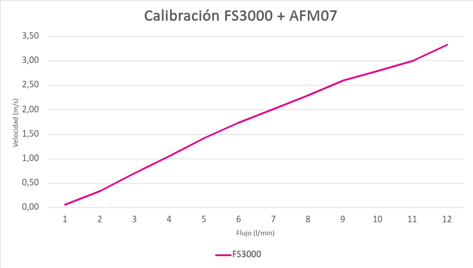

# Manual de usuario EOLO Standard

EOLO Standard se opera desde pantalla con encoder y boton. Permite programar sesiones, ajustar flujo, registrar material particulado, variables ambientales, flujo, bateria y viento, y subir datos mediante modem cuando esta disponible.

## Preparacion

1. Conecte baterias o alimentacion DC.
2. Inserte una microSD.
3. Revise mangueras, filtros, bombas y entrada/salida de aire.
4. Verifique que el sensor AFM07, Plantower y anemometro esten conectados.
5. Encienda el equipo y espere el menu principal.

## Controles e iconos

- **Encoder:** gire para cambiar valores o moverse por menus.
- **Boton del encoder:** presione para confirmar.
- **Pantalla:** muestra hora, estado SD, nombre EOLO, modem y energia.
- **Icono SD:** indica tarjeta disponible, escritura o error.
- **Icono modem:** muestra alimentacion, actividad, error y nivel de senal.
- **Energia:** muestra doble bateria; si hay DC, aparece indicado en la barra superior.

## Menu principal

| Opcion | Uso |
| --- | --- |
| Nueva sesion | Crea una captura programada desde cero. |
| Continuar sesion | Reanuda una sesion guardada, si existe. |
| Captura rapida | Inicia una captura cercana al momento actual, con duracion por defecto de 1 hora. |
| Ajustar reloj | Permite cambiar la hora manualmente o sincronizar por red. |
| Calibrar bombas | Ejecuta la calibracion guiada de bombas y flujo. |

## Nueva sesion

1. Seleccione **Nueva sesion**.
2. Ajuste el **flujo objetivo** entre 0.0 y 8.0 L/min.
3. Confirme la **hora de inicio**.
4. Confirme la **hora de fin**. La pantalla muestra la duracion calculada.
5. El equipo pasa a espera. Se muestra flujo actual, hora de inicio y tiempo restante.
6. Al llegar la hora de inicio, comienza la captura.
7. Al llegar la hora de fin, la captura termina y las bombas se apagan.

Durante la espera, al presionar el boton se vuelve al menu principal y se guarda la sesion.

## Captura rapida

1. Seleccione **Captura rapida**.
2. Ajuste el flujo objetivo entre 0.0 y 8.0 L/min.
3. Confirme con el boton.
4. El equipo programa el inicio inmediato y una duracion de 1 hora.

## Pantalla durante captura

La pantalla principal muestra flujo actual y volumen capturado. Girando el encoder se recorren vistas inferiores con:

- Temperatura, humedad y presion.
- PM1.0, PM2.5 y PM10.
- Flujo configurado.
- Tiempo transcurrido.
- Tiempo restante.
- Hora de fin.

Presione el boton para abrir el menu de captura.

## Menu durante captura

| Opcion | Uso |
| --- | --- |
| Continuar | Vuelve a la captura. |
| Finalizar | Termina la captura y apaga bombas. |
| Probar bombas | Permite probar bombas y ver flujo medido. |
| Ajustar hora fin | Cambia la hora de termino. |
| Ajustar reloj | Ajusta o sincroniza el reloj. |
| Ajustar flujo | Cambia el flujo objetivo de la sesion. |

## Datos generados

Los datos se guardan en:

```text
/EOLO/logs/log_<fecha>.csv
```

El intervalo de registro es de 10 segundos. El CSV de EOLO Standard contiene:

```text
time,flow,flow_target,temperature,humidity,pressure,pm1,pm25,pm10,wind_speed,wind_direction,battery_pct
```

Cuando el modem esta disponible, el equipo puede preparar y subir datos por red. Si no hay senal o el modem no esta listo, la captura local en SD sigue siendo la referencia principal.

## Reloj

En **Ajustar reloj** hay tres opciones:

- **Cambiar hora:** ajuste manual de hora y minuto.
- **Sincronizar:** intenta sincronizar el reloj mediante red.
- **Regresar:** vuelve a la pantalla anterior.

Revise el reloj antes de iniciar campanas largas, porque el nombre del archivo y la columna `time` dependen de esta hora.

## Calibracion de bombas

Use **Calibrar bombas** cuando:

- Se cambien bombas, mangueras o componentes del circuito de aire.
- El flujo real no siga el flujo objetivo.
- Se prepare el equipo para una campana critica.

Procedimiento:

1. Asegure que el circuito de aire este armado como se usara en terreno.
2. Seleccione **Calibrar bombas**.
3. El equipo mide cada motor, identifica el motor debil y genera rampas de calibracion.
4. Espere hasta que el proceso termine y el equipo reinicie.
5. Realice una captura corta de prueba.

Referencia visual de calibracion de flujo:



Advertencias:

- No obstruya el flujo durante la calibracion.
- No desconecte sensores ni bombas durante el proceso.
- Si la calibracion falla o el flujo queda inestable, revise fugas, filtros, mangueras y alimentacion antes de repetir.
